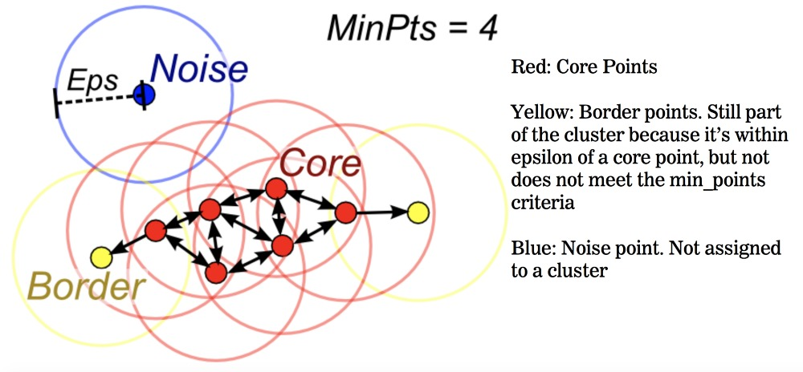
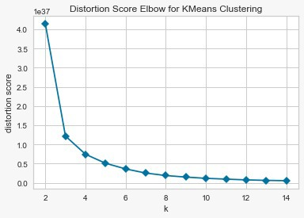

# Anomaly Detection in Network Traffic using Clustering Techniques

Malicious cyber attacks is a common phenomenon in today’s world, which puts at more risk our data. One’s data is one’s property that needs security. Anomaly detection is an important technique to discover data points that act different from the norm. We apply this concept to contribute to network safety and security. With the help of publicly data set available on UCI known as Detection of IOT Botnet Attacks, we analyse and study the network properties. We use K means, DB Scan, Mean-Shift and Expectation Maximization clustering using Gaussian Mixture Models algorithms to create a comparative study of clustering techniques and assess the performance of each technique. This is followed by detecting anomalies by the same techniques and assessing the performance of anomaly detection and finally conclude which technique gives best result to detect anomaly in the traffic.

Introduction
============

Today, Internet has connected us all in such a way that we can’t imagine a life without it. Each one of us makes several web transactions enabling private and important data accessible to an attacker. With the innumerable advantages that internet(inter network of networks) comes great risk of getting one’s data misused. If web applications and its uses are prevalent, so are the cyber attacks. With the advancement in technology till date, concealing one’s identity is a simple task. The multitude of people using applications with dynamic port numbers, Virtual Private Networks, encryption techniques as a part of their virtual disguise in today’s time, is high. This, in turn, increases our duties as responsible Engineers to prevent such attacks and make our network secure. With the purpose of identifying and preventing such attacks, anomaly detection is being used in networks to spot suspicious behavior or network characteristics. In order to automate this process and make it more efficient, both supervised and unsupervised machine learning techniques can work well. This report presents our study of implementing various techniques that we found fit, analysing their results and suggesting relevant future scope in the field.

Related Work
============

Essentially, anomaly detection is the identification of items, events or observations that do not conform to an expected pattern or other items in a dataset. To do so in a network, the most fundamental and commercial technique is to employ signature-matching algorithms to detect malicious activities. To automate this, generally supervised machine learning techniques act as a reasonable approach with the objective to create a baseline profile using former data with pre-labeled intrusion instances to train a supervised learning model. The model then maps normal behavior to a baseline profile and tries to detect deviations. Some popular techniques include KNN, decision tree, Naïve Bayes classifier, SVMs, Artificial Neural networks and even Recurrent NN etc. However, we explore the terrain of unsupervised machine learning techniques, accounting to the fact that there is ample of network data produced every millisecond, and this technique will help us comprehend the network attributes and discover the peculiarities with minimal human intervention. Unsupervised machine learning facilitates unveiling of unusual patterns in data. This makes unsupervised machine learning a good approach for the application of anomaly detection in a network. From here, the problem can be reduced to performing clustering. This is because clustering techniques help us discern between usual data points and anomalies. Clustering produces groups that are more closely related, and can highlight any noise/ data point that has abnormal properties. Since, most of the malicious attacks have unusual IP addresses or other unusual features, clustering techniques work well to spot such data points. This knowledge can be later used to prevent attacks on the network in the future by taking appropriate action. Although it is not the case that unsupervised technique was never explored by other researchers, but this field demands more innovative implementations as theoretically, it seems like the perfect fit for this type of problem.

Background Information
======================

We define a few concepts in this section that are related to our project. Let us begin with Unsupervised machine learning. The textbook definition is that it is a learning technique that learns on its own the important features of the data provided, and models it without supervision. It can work considerable well with unlabelled data. This makes it a very useful technique as more often than not, data is unlabelled, and requires unsupervised learning. Anomaly detection, as defined above is detecting data points in a distribution that show behavior quite different than usual, these points do not conform to the norm,aka Outliers. The standard definition of Clustering is to gather points more similar to each other as a bunch. This concept when drawn to unsupervised machine learning can be implemented to understand customer behavior, market trends and detect anomalies. Anomaly Detection findds its applications in fraud detection, fault detection, detecting ecosystem disturbances among many others.

Proposed Approach
=================

As discussed, we propose an approach where we begin by laying out the foundation of anomaly detection by first making clusters. In other words, we divide the project in two stages, (1) Forming clusters ,(2) Detecting anomalies. Each stage is implemented using multiple techniques and then evaluated based on multiple metrics. We further elaborate on techniques used for clustering and anomaly detection in following sections. Mapping the anomalies to the clusters give us substantial results to comprehend how the approach works. And finally, we based on tabulated results, we conclude which model performed better.

Clustering Methods
------------------

### K-means

This is the most fundamental clustering technique. K means is an iterative clustering algorithm which in each iteration tries to classify a data point to one of the clusters in hand based on higher similarity. It prompts for initial number of clusters(k), and then distributes data into clusters. As demonstrated from elbow curve(Fig 1), larger number of clusters(k) imply more similarity. This comes from the fact the higher the value of k, the fewer data points in a cluster, the smaller value is calculated for distance for each point in a cluster with its centroid. This would increase chances of over-fitting and capturing noise and over-specific patterns, thereby producing smaller groups with high granularity. The same logic holds for lower k generating larger groups with less granularity.

### Density-based spatial clustering of applications with noise (DBSCAN)

As the name suggests, this technique forms clusters based on densities. In essence, the algorithm looks for densely populated regions to assign them as one cluster. It takes into account to minimize intra-cluster distance and maximize inter-cluster distance, which makes it a better modelling technique than DB scan, even for outlier detection. This is demonstrated in the Figure below.

### Mean-Shift Clustering

The wikipedia definition is “Mean shift is a non-parametric feature-space analysis technique for locating the maxima of a density function, a so-called mode-seeking algorithm”. In layman terms, Mean shift algorithm processes every point, like in KNN by calculating its k-nearest neighbors. Next,this point is replaced by the mean(median) of the cluster formed. This was one iteration, this is done over and over until the clusters formed become stable. What makes Mean shift special is it uses the concept of sliding window. It can be visualized as a fixed dimension that captures the points in it and uses them to form a clustering model. It updates the candidates for center points to be the mean of the points within the sliding-window.It also impressively works better in the case when there are high number of outliers. In such complicated scenarios, K means might fail along with other conventional algorithms.

### Expectation–Maximization (EM) Clustering using Gaussian Mixture Models (GMM)

Implicit from the name, Gaussian Mixture Models assume Gaussian distribution on data and generate probabilities of each data point belonging to each cluster. It uses the expectation-maximization (EM) algorithm to recover the original Gaussian that led to this distribution. In anomaly detection, this technique can be used as we can consider data points having probabilities belonging to each cluster close to 0 as to being noise, or outlier. Other than having to set initial number of clusters, and a threshold for a point to be regarded as an anomaly, the algorithm is good to go on its own and has shown to produce considerable results.

Evaluation Methods
------------------

Clustering is a pretty standard technique but how do we evaluate the “goodness” of the performance of the technique. More importantly, we wish to address the question whether or not if anomalies are detected. If so, how “good” is the performance of the implemented technique is in doing the same. There are many evaluation metrics which can be used, however they may not be unerring. But within the scope of the project, we have shortlisted to : Davies Bouldin Index and Silhouette Index as measures of evaluation of clustering performance. And KNN and Isolation Forest help us answer the question how good is the anomaly detection. Moreover, we briefly define Elbow method which we used to find ideal number of clusters. This was done to narrow down multiple results for various number of clusters which we obtained from K means.

To find anomalies in a data distribution, one way is to find which data points behave differently than most and deviate from common statistical properties, and flag such points as anomalies. However, this approach fails when malicious adversaries adapt themselves to disguise as normal, or precision between noise and abnormal behavior is ambiguous. This gives rise to the need of a more sophisticated approach. conditions required to separate a given observation.

### Davies Bouldin Index

This method tells how well the clustering has been done is made using quantities and features inherent to the dataset. It works on the principle where it classifies a clustering technique good when the inter-cluster similarity is low and the intra-cluster similarity is high.Lower the DB index value, better is the clustering. However, it falls short to the best information retrieval.

where  is a measure of scatter within the cluster and  is the separation between the  and the  cluster

### Silhouette Index

Cluster Cohesion is the sum of the weight of all links within a cluster. Cluster separation is the sum of the weights between nodes in the cluster and nodes outside the cluster. Silhouette Coefficient combines the ideas of both cohesion and separation but for individual points, as well as clusters and clusterings. It can range between -1 and 1. The closer it is to 1, the more similar clusters Interpretation and validation of consistency within clusters of data.

For data point  in cluster 

For each data point  in  we now define

We now define a silhouette (value) of one data point \(i\)

 1">

and 

Choosing Optimal Number of Clusters
-----------------------------------

### Elbow Method

This method is one of the most popular data mining technique to find optimal number of clusters. The shape of the graph resembles that of an elbow deriving its name. The working principle behind this is as the number of clusters increase, the change in the average distance(of the data point) to centroids will evidently decrease, and so does the SSE(Sum of squared errors). However, finding the right number of clusters is important to lead us in the right direction. This is where Elbow method comes in the picture which tracks the relative change in the distance and stops for the ideal k, when the change is too little. It is a heuristic method to validate the number of clusters.

### KNN

k-NN is a simple, non-parametric lazy learning technique used in clustering. It uses the metrics to calculate Eucledian distance, Manhattan, Minkowski, or Hamming distance, to ultimately substantiate clusterings results. But KNN is not merely restricted for making clusters. It also performs well to identify anomalies and evaluate how good is the performance for the same task. KNN uses Relative density of data, aka local outlier factor (LOF) which is based on a distance metric called reachability distance. Data points that do not conform to local trends can be regarded as outliers based on a set threshold. KNN uses underlying patterns in the data to make predictions, any errors in these predictions thereby turning into a predictive model. To evaluate its performance, we can use results from other techniques and compare them. We could also visualize the clusters and look for ourselves if the data points claimed as “anomalies” by the technique is actually an outlier or not.

### Isolation Forest

Another way to detect outliers is using Isolation Forest. This is a relatively new and useful unsupervised technique that works on the concept of building a model with a small number of trees using small sub-samples of fixed size. The method consumes less memory and has a lower time complexity(linear, while others quadratic) in comparison with other methods, making it favorable for our use case. It uses isolation in place of basic distance and density metrics. How Isolation Forest works is it sets apart any data point that does not conform to the usual norm. It begins with constructing the separation by first creating isolation trees, or random decision trees. Then, based on the underlying principle of the more path length to isolate the observation, the higher the chances of it being an anomaly, it assigns the data point a score. In essence, the algorithm isolates data points by randomly selecting a feature and then randomly selecting a split value between the maximum and minimum values of the selected feature. In addition, one must realize it is easier to isolate anomaly observations than to isolate normal ones because of the fewer number of anomalies present in a use case. It ends up learning a few conditions to characterise what may act as an anomaly and what may not. And therefore, an anomaly score can be calculated.

Experiments
===========

Dataset description
-------------------

The dataset we chose is Detection of IOT Botnet Attacks, which we fetched from UCI repository. The dataset is a multivariate sequential collection of 115 attributes with 7062606 instances out of which around 50000 were used by us because of computational limits. It does not contain any missing values. This data contains instances of 10 different types of attacks by 2 botnets. Most of the attributes are statistics of the packets and other networking data for multiple IPs. The data is real network traffic data gathered from 9 different commercial IoT devices.

Experimental setup
------------------

Originally the dataset is loaded and ran through multiple clustering techniques to form clusters. The experiment will show us the quality of the clusters formed by evaluating the clusters using various evaluation metrics. We do not rely on just one metric since this is an objective approach. We expect K means to perform well for clustering along with Mean shift, better than others. To find anomalies, after the clusters are formed, they are compared with some anomalies detection algorithms like Isolation Forest and KNN, to see how well our methods separated out the anomalies. We expect to find GMM work better to find anomalies than K means because although both algorithms need to have number of clusters initialized, GMM produces class probabilities and cluster variances which makes it a richer model. Additionally, K means gets affected by the outlier and may not be that impactful to detect one. Finally, based on the results we can analyse and conclude which technique what works best for the case.

Discussion of results
---------------------

As shown in Table [tab:kmeans], various clusters were used and their Davies Bouldin Score and Silhouette Score was calculated, to see how different number of clusters affect the evaluation metrics for K-Means. From Table [tab:evalall] it can be observed that GMM is performing significantly poorly when compared to other methods. Rooting from the fact that the data distribution was normal, the GMM performed poorly and such results were expected. It failed to find optimal clusters. It seems that the difference in size of clusters is also really significant. The Silhouette score for DB SCAN technique was negative, this normally indicates that a sample has been assigned to the wrong cluster, as a different cluster is more similar. Although the Davies Bouldin score for DB SCAN is higher than the others but a negative silhouette score is just not acceptable. So we rule out DB SCAN as a potential technique for creating good clusters for this particular dataset. Mean Shift Clustering has a low Davies Bouldin Index but a really good Silhouette Score. For K-Means, using the Elbow method, it can be seen from Figure [fig:elbow] that the optimal number of clusters would be 5, so we check the Davies Bouldin Index and Silhouette score of K-Means for 5 clusters and astonishingly it turns out that its Davies Bouldin Index score and Silhouette score are both slightly higher than mean shift, and thus we can say that it would be the best metric to evaluate our dataset, and it has the best result in turn of both the evaluation metrics.

Now, deciding how well our clusters worked on separating or identifying anomalies for the data. As we have no way of really knowing which points are the anomalies in the data we resort to using methods like Isolation Forest and K-Nearest-Neighbors to find anomalies and see if they somehow overlap with what out clusters indicate. First of all we see that K-NN and Isolation Forest return almost 95% of the same points as anomalies, which is quite good for the purpose of this research. Then we go on to see how many of this points belong to which clusters. In Table [tab:gmmAno] and Table [tab:kmeansAno] we see that each point belongs to some cluster and for those clusters we have calculated how many of them are anomalies. It is observed that for GMM one cluster is fully identified as anomalies while the rest of the anomalies are divided into different clusters, but for K-Means it can be observed that for 4 clusters the anomalies are consisting of almost 100% anomalies. So K-means did a really good job of assigning anomalies to different clusters.

|  Cluster #  | GMM (6 Clusters) | Anomalies (Isolation Forest) | Anomalies (KNN) |
|:-----------:|:----------------:|:----------------------------:|:---------------:|
| Cluster # 1 |      25981       |             517              |       144       |
| Cluster # 2 |       5969       |             872              |      3864       |
| Cluster # 3 |      10039       |             2727             |       214       |
| Cluster # 4 |       197        |             197              |       185       |
| Cluster # 5 |       7362       |             642              |       386       |
|    Total    |      49548       |             4955             |      4793       |

|  Cluster #  | K-Means (5 Clusters) | Anomalies (Isolation Forest) | Anomalies(KNN) |
|:-----------:|:--------------------:|:----------------------------:|:--------------:|
| Cluster # 1 |        49127         |             4562             |      4418      |
| Cluster # 2 |          47          |              47              |       47       |
| Cluster # 3 |         111          |             111              |      103       |
| Cluster # 4 |         239          |             211              |      201       |
| Cluster # 5 |          24          |              24              |       24       |
|    Total    |        49548         |             4955             |      4793      |

 

|Clusters|Davies Bouldin Score|Silhouette Score|
|:------:|:------------------:|:--------------:|
|02|0.199188|0.995013|
|03|0.374277|0.992362|
|04|0.540960|0.991107|
|05|0.594850|0.990359|
|06|0.510346|0.989430|
|07|0.518138|0.989445|
|08|0.513823|0.988725|
|09|0.495977|0.988651|
|10|0.506313|0.988391|
|11|0.531904|0.988123|
|12|0.537146|0.988253|
|13|0.490338|0.988401|
|14|0.461464|0.988511|
|15|0.458446|0.988190|
|16|0.436359|0.988172|
|17|0.439417|0.987734|
|18|0.363389|0.988371|
|19|0.358022|0.988003|

|Clusters|Davies Bouldin Score|Silhouette Score|
|:------:|:------------------:|:--------------:|
|K-Means (5 Clusters)|0.594850|0.990359|
|Mean Shift Clustering|0.358022|0.988003|
|DBSCAN|2.094600|-0.976573|
|EM Clustering with GMM|0.5396314866914412|0.6511184797554266|

Conclusions and Future Work
===========================

K-Means outperforms the rest of the models in both the evaluation metrics (i.e. Davies-Bouldin and Silhouette) for its optimal number of clusters. For the anomalies detected using Isolation Forest and KNN, almost some of the clusters in K-Means were entirely anomalies, which just highlights the K-Means capability to separate anomalies to different clusters. So it can be concluded that K-Means does a good job of finding anomalies for network traffic. Still many optimizations can be made in order to further improve anomaly detection.

In the future, it might be useful to try different variations of K-Means such as K-Means Hybrid Algorithms which capitalise on other algorithms to improve upon K-Means as K-Means gave the best results. Other metrics and techniques such as Dunn Index and Spectral Clustering can be tried and compared with our current techniques to see if they yield better results. These techniques can be tried on some labeled data, and it would be really easy to verify that how well our clusters actually separate anomalies from the normal traffic. Given a really powerful system, even bigger data can be used so that we have more instances to train and test our model.

Acknowledgements
================

We take this opportunity to acknowledge the contributions of those who made this project work substantial. Our mentor, Dr. Tina Eliassi Rad constantly guided us in the right direction from recommending useful and up to date data sets to suggesting the art of the state techniques. This ensured our work was headed in the right direction at all times. Time and again, the Course material provided by our Professor, Dr. Tina Eliassi Rad, helped us resolve many minor hiccups we had in the course of the project. Other useful resources were Research papers on the topic that provided us with clear understanding of the problem, its intensity which helped us come up with good insights eventually.

References
================

- https://en.wikipedia.org/wiki/Mean\_shift/
- https://archive.ics.uci.edu/ml/datasets/detection\_of\_IoT\_botnet\_attacks\_N\_BaIoT
- https://towardsdatascience.com/anomaly-detection-for-dummies-15f148e559c1
- https://towardsdatascience.com/best-clustering-algorithms-for-anomaly-detection-d5b7412537c8 
- http://cs.uef.fi/sipu/pub/MSc\_JiaweiYang.pdf 
- https://towardsdatascience.com/the-5-clustering-algorithms-data-scientists-need-to-know-a36d136ef68
- https://annalyzin.wordpress.com/2016/09/14/k-nearest-neighbors-anomaly-detection-tutorial/
- https://blog.easysol.net/using-isolation-forests-anamoly-detection/ 
- https://www.kdnuggets.com/2017/04/datascience-introduction-anomaly-detection.html
